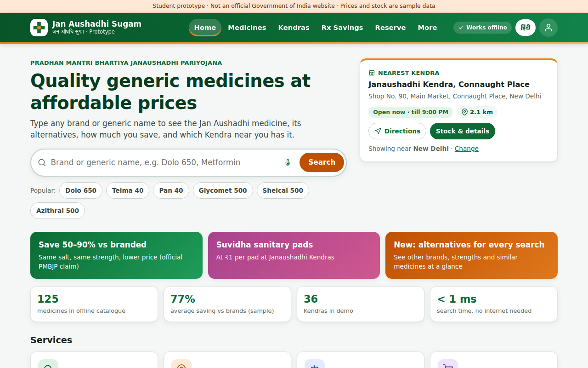
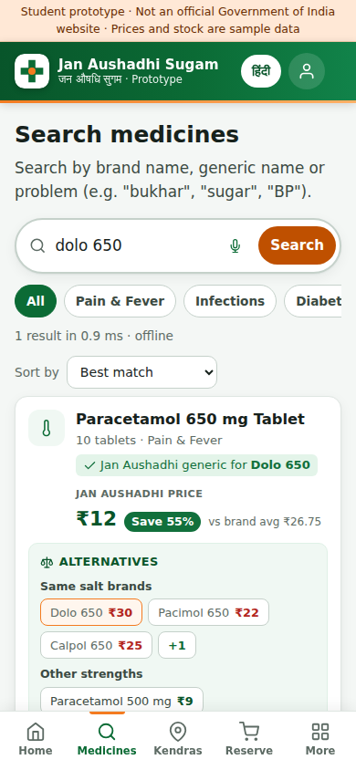
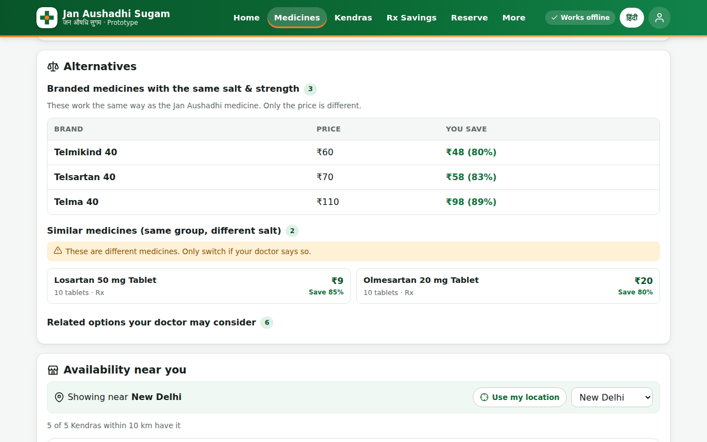
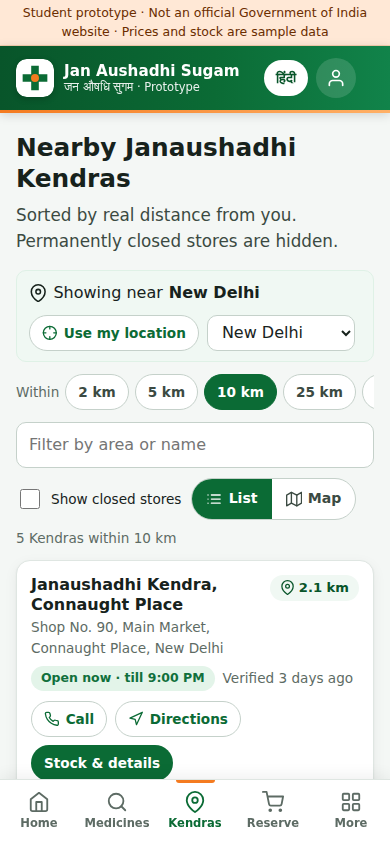
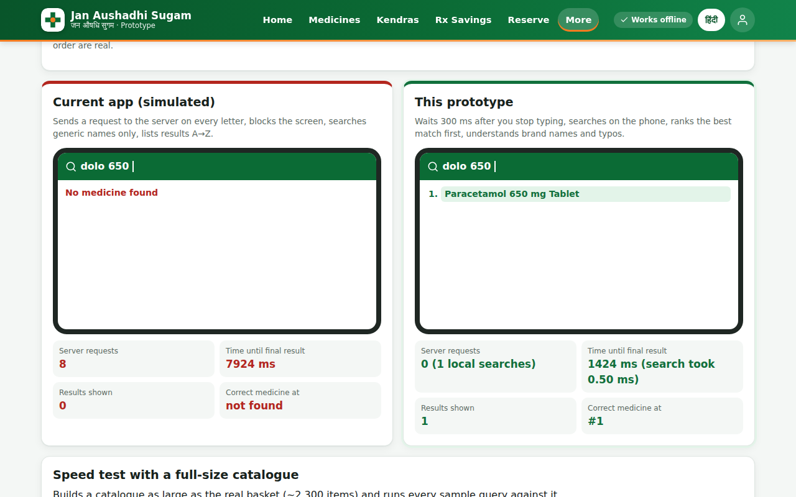

# Jan Aushadhi Sugam — Faster Prototype (Student Project)

A working **website prototype** of the *Jan Aushadhi Sugam* app. It keeps every service of the original app, fixes the problems users complain about most, and adds the feature users keep asking for: **alternative medicines shown for every search**.

- **No framework, no build step, no dependencies:** plain HTML, CSS and JavaScript
- **Works offline** after the first visit (service worker + on-device catalogue)
- **Installable** as an app on phones (PWA)
- **English + हिंदी**, voice search, large text and high-contrast modes

> ⚠️ **Student project prototype.** This is **not** an official Government of India or PMBI website. Medicine prices, stock and Kendra details are **sample data** for demonstration only. Always check prices and availability at a Kendra.

---

## Screenshots

| Home (desktop) | Search with alternatives (phone) |
|---|---|
|  |  |

| Alternatives on the medicine page | Kendra locator (phone) |
|---|---|
|  |  |

| Performance Lab: before vs after |
|---|
|  |

---

## Contents

1. [Quick start](#1-quick-start)
2. [The problem](#2-the-problem-from-user-reviews)
3. [What this prototype fixes](#3-what-this-prototype-fixes)
4. [All services of the original app](#4-all-services-of-the-original-app)
5. [Alternatives for every medicine](#5-alternatives-for-every-medicine)
6. [Pages and routes](#6-pages-and-routes)
7. [Project structure](#7-project-structure)
8. [How it works](#8-how-it-works)
9. [Sample data](#9-sample-data)
10. [Tests](#10-tests)
11. [Limitations and next steps](#11-limitations-and-next-steps)
12. [Credits and licence](#12-credits-and-licence)

---

## 1. Quick start

**Requirements:** a modern browser. [Node.js](https://nodejs.org) 18+ is only needed for the local server and the tests.

```bash
git clone https://github.com/harshitkumar09-tech/Jan-Aushadhi-App.git
cd Jan-Aushadhi-App
npm start
```

Then open **http://localhost:8080**. You don't need `npm install` because the project has no dependencies.

| Way to run | Offline mode | Notes |
|---|---|---|
| `npm start` (recommended) | ✅ | Tiny Node server in `scripts/serve.js`. Set `PORT=3000` to change the port. |
| `python3 -m http.server 8080` | ✅ | Works if you don't have Node. |
| Double-click `index.html` | ❌ | Everything works except offline mode, because service workers need a web server. |

## 2. The problem (from user reviews)

The Jan Aushadhi Sugam app is rated **3.2★ on Google Play** and **3.1★ on the App Store**. The biggest complaint is **lag**: users describe "Please wait" screens lasting **2–4 minutes per search**. Other common complaints:

- Search starts after one letter and shows a long A→Z list of **irrelevant medicines**.
- The app says a medicine is **available**, but the Kendra says it's **out of stock**.
- The "nearest" Kendra is **hundreds of km away**, and some listed Kendras are **permanently closed**.
- **OTP / sign-up dead-ends** and "unexpected error occurred" messages.
- No ordering, no way to complain, English only, and hard to use for elderly people.

## 3. What this prototype fixes

| Problem users report | Fix in this prototype | Where in the code |
|---|---|---|
| "Please wait" for 2–4 min on every search | The medicine list is stored **on the device** (offline cache + service worker). Search runs locally in **well under 1 ms**. | `js/search.js`, `sw.js` |
| Search fires after 1 letter and shows an irrelevant A→Z list | **300 ms debounce**, **minimum 3 letters**, **ranked** results, **typo tolerance** ("paracetmol"), **brand → generic** ("Dolo 650" → Paracetamol 650) | `js/search.js` (`DEBOUNCE_MS`, `MIN_QUERY_LENGTH`) |
| App "loads every 2 seconds" | **No polling.** Updates are checked once when the app opens (at most every 12 h), and only changes are downloaded | `js/app.js → checkForUpdates()` |
| Shows "available" but the Kendra says no | Stock always shows **how old it is** ("updated 12 min ago"). One tap on **"Kendra said no?"** marks it out of stock until the Kendra confirms | `js/services.js → stockFor()` |
| "Nearest" store is far away or closed | Sorted by **real distance**, **2–50 km** range, an honest *"nearest is X km away"* message, **closed stores hidden**, "verified N days ago", and a way to report a wrong store | `js/services.js → kendrasNear()` |
| OTP stuck / unexpected error | **Login is optional.** The OTP screen has clear errors, a resend timer, "change number" and "continue as guest" | `#/login` |
| No ordering | **Reserve for pickup** with a pickup code. Home delivery is marked as the next step | `#/cart`, `#/orders` |
| Can't find the generic for a prescription | **Prescription savings**: paste brand names and get the generics plus total savings | `#/compare` |
| English only, hard for elderly users | **Hindi**, **voice search**, **large text**, **high contrast** | `js/i18n.js`, `#/settings` |
| Heavy app on low-end phones | No framework and a small download. The map library is loaded **only when you open the map** | `index.html`, `loadLeaflet()` |

**Measured speed** (Performance Lab, full-size catalogue of 2,300 items): about **0.4 ms** per search on average, with **0 server requests** while typing. The old behaviour (simulated) sends **8 requests** for "dolo 650" and still finds nothing, because it can't search brand names.

## 4. All services of the original app

Same design idea as the original: green + saffron colours and dashboard tiles.

| Original app service | In this prototype |
|---|---|
| Search generic medicine | ✅ `#/search`: brand or generic name, category filter, sort by price or saving, voice search |
| Brand vs generic price comparison & savings | ✅ On every result and medicine page (bar chart, per-month / per-year savings calculator) |
| Locate nearby Kendra (list + Google Maps directions) | ✅ `#/kendras`: GPS or city, radius, list/map, **Directions** opens Google Maps |
| Kendra details (address, timings, phone) | ✅ `#/kendra/:id`: open now, hours, call, directions, report a problem |
| Check medicine availability | ✅ Per-Kendra stock with a "last updated" time and a correction button |
| Login / registration with OTP | ✅ Optional, with clear errors and guest mode |
| Feedback | ✅ `#/feedback`: complaint tickets with ticket numbers |
| About PMBJP, FAQ, helpline | ✅ `#/about`, `#/help` |
| **New:** alternatives for every search | ✅ Same-salt brands, other strengths, similar medicines |
| **New:** prescription savings | ✅ `#/compare` |
| **New:** reserve for pickup | ✅ `#/cart`, `#/orders` |
| **New:** Hindi, large text, high contrast, offline mode, installable (PWA) | ✅ |
| **New:** Performance Lab (before vs after demo) | ✅ `#/lab` |

## 5. Alternatives for every medicine

Every search result shows an **Alternatives** box, and the medicine page shows the full list:

1. **Same salt brands**: branded medicines with the same salt and strength (for example Telma 40, Telmikind 40 and Telsartan 40 for *Telmisartan 40 mg*), with the price and how much you save with Jan Aushadhi.
2. **Other strengths**: the same salt in another strength or form (for example Paracetamol 500 mg, 650 mg, syrup).
3. **Similar medicines (ask doctor)**: same medicine group, different salt (for example Losartan and Olmesartan for Telmisartan). These carry a warning because they are **different drugs**.
4. **Related options**: the wider family (for example other blood-pressure groups). Hidden by default, with a warning.

The logic is in `alternativesFor()` in `js/services.js`.

## 6. Pages and routes

The app is a single page with hash routes, so it works on any static host.

| Route | Page |
|---|---|
| `#/` | Home dashboard |
| `#/search?q=&cat=` | Search with alternatives |
| `#/medicine/:id` | Medicine detail, savings, stock near you |
| `#/kendras` | Kendra locator (list / map) |
| `#/kendra/:id` | Kendra detail and stock |
| `#/compare` | Prescription savings |
| `#/cart` | Reserve for pickup |
| `#/orders` | My reservations |
| `#/feedback` | Complaints / feedback |
| `#/login` | Optional OTP login |
| `#/settings` | Language, text size, contrast, offline data |
| `#/help`, `#/about`, `#/more` | FAQ & helpline, about PMBJP, more menu |
| `#/lab` | Performance Lab (before vs after demo) |

## 7. Project structure

```
index.html              page shell + SVG icon sprite
manifest.webmanifest    install as an app (PWA)
sw.js                   service worker (offline mode, stale-while-revalidate cache)
css/styles.css          all styles (colour tokens at the top)
js/data/medicines.js    SAMPLE catalogue: 125 medicines/devices in 12 categories, brands, illustrative prices
js/data/kendras.js      SAMPLE Kendras: 37 stores in 14 cities (placeholder phone numbers)
js/search.js            offline search engine (inverted index, ranking, typos, brand → generic, Hindi)
js/services.js          alternatives, savings, distance, opening hours, simulated stock
js/i18n.js              English + Hindi text
js/app.js               pages, routing, cart, login, feedback, settings
js/lab.js               Performance Lab (before vs after demo)
assets/                 app icons (SVG source + 192/512 PNG)
docs/screenshots/       screenshots used in this README
tests/                  unit tests (node --test)
scripts/serve.js        tiny local web server (no dependencies)
scripts/make-icons.js   renders the PNG icons from assets/icon.svg (needs Playwright)
```

The data files use a small UMD wrapper, so the same file works as a browser `<script>` (on `window.JA`) and as a Node `require()` in the tests.

## 8. How it works

- **Offline catalogue.** The real basket (~2,000 medicines + ~300 surgicals) is only a few hundred KB, so it ships with the app and the service worker caches it. After the first visit, search needs no internet at all.
- **Search index.** At start-up, every medicine name, salt, brand, Hindi name and use is split into words. Each distinct word points to the medicines that contain it (an *inverted index*). Each query word is compared once with each distinct word: exact, starts-with, contains, or typo (edit distance). Only medicines that match **every** typed word are scored, so there are no irrelevant results.
- **Debounce.** The search waits 300 ms after the last key press and needs at least 3 letters.
- **Stock freshness.** In a real deployment, each Kendra's billing (POS) software would push stock every few minutes. The app shows how old the data is, and user reports override it until the Kendra confirms.
- **Delta sync (proposed API).** `GET /catalog/changes?since=2026.09.20` returns only the rows that changed. The app calls it once when it opens, never in a loop.
- **Offline cache.** `sw.js` serves app files from the cache first and refreshes them in the background (stale-while-revalidate). **Bump `CACHE` in `sw.js` whenever you edit a cached file**, or returning visitors will keep the old version.
- **Safe storage.** Settings, cart and orders are kept in `localStorage` under a `jas.` prefix. Every read and write is wrapped so the app still works when storage is blocked.

## 9. Sample data

| File | Contents | Row format |
|---|---|---|
| `js/data/medicines.js` | 125 items, 12 categories | `[id, salt, strength, form, pack, category, class, JA price, Rx needed, "Brand:price\|…", display name?, availability?]` |
| `js/data/kendras.js` | 37 Kendras, 14 cities (1 marked closed) | `[id, area, city, lat, lng, opens, closes, status, verified days ago, stock level 0–1]` |

To add a medicine or Kendra, add a row in the same format. The search index and alternatives are rebuilt automatically when the page loads.

## 10. Tests

```bash
npm test
```

This runs 19 unit tests with Node's built-in test runner (`node --test`), with no extra packages:

- `tests/search.test.js` (11 tests): brand → generic, ranking, typo tolerance, Hindi and Hinglish, minimum length, "every word must match", "did you mean" suggestions, speed
- `tests/services.test.js` (8 tests): alternatives, savings maths, distance sorting, hidden closed Kendras, opening hours, stock and user reports

To regenerate the PNG icons after editing `assets/icon.svg`:

```bash
npx -y playwright install chromium
node scripts/make-icons.js
```

## 11. Limitations and next steps

**Limitations**
- All prices, stock and Kendra details are **sample data**. Brand prices are rough examples, not live MRPs.
- Stock levels are **simulated**, and OTP login is a **mock** (no SMS is sent).
- The helpline number shown (1800-180-8080) should be **checked against the official Jan Aushadhi website** before the demo.
- The map uses OpenStreetMap through Leaflet (loaded from cdnjs). It needs internet, but the list view works offline.

## 12. Credits and licence

- Icons are in the style of [Feather Icons](https://feathericons.com) (MIT licence).
- Map: [Leaflet](https://leafletjs.com) + © [OpenStreetMap](https://www.openstreetmap.org/copyright) contributors.
- Problem research: Google Play and App Store reviews, Department of Pharmaceuticals survey, PIB and news reports.
- Code licence: **MIT** (as declared in `package.json`).

*Jan Aushadhi, PMBJP and PMBI are names of Government of India schemes and bodies. They are used here only to describe the student project. This prototype is not affiliated with or endorsed by them.*
